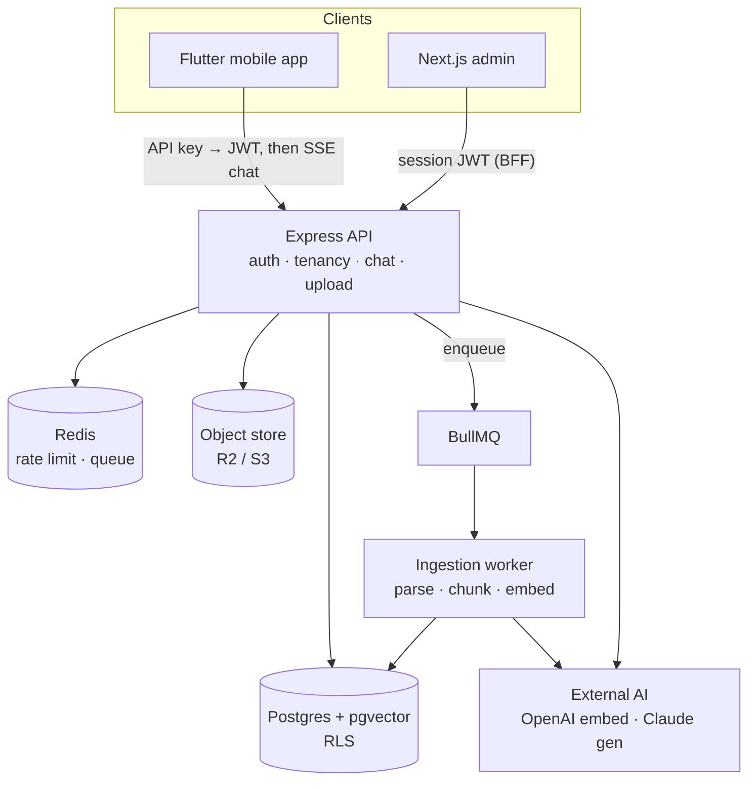

# Architecture

_Chat with Your Business_ is a multi-tenant RAG SaaS: an SMB uploads its
documents and gets a mobile assistant that answers customer questions **with
cited sources** and **refuses** ("I don't know") when the answer isn't in the
corpus. This document covers the system shape, the multi-tenancy model, the RAG
pipeline, and the guardrails that make refusal a first-class outcome.

> Source of truth for the phased plan and data model: [`PROJECT_PLAN.md`](../PROJECT_PLAN.md).

## Components

A monorepo (npm workspaces) with four deployables plus a shared package:

| Component | Tech | Role |
| --- | --- | --- |
| `api` | Express + TypeScript (zod) | Auth, tenancy, upload, streaming chat, admin surface |
| `worker` (in `api`) | BullMQ | Async ingestion: parse → chunk → embed → pgvector |
| `admin` | Next.js (App Router) | The builder: upload, playground, publish, API keys |
| `mobile` | Flutter (BLoC + Dio) | The consumer chat: streaming answers, citations, refusal |
| `packages/shared` | TypeScript | Provider interfaces (`Embedder`, `Chat`, `Reranker`) + shared types |

External AI sits behind **narrow, swappable interfaces** — feature code never
calls a vendor SDK directly, so a provider swap is a change in one factory.



## Two request flows

**Builder path (ingestion) — uploads never block:**

```
admin upload
  → API: store raw file in object storage (R2/S3) + enqueue a BullMQ job
  → worker: parse (pdf/docx/md/txt) → structure-aware chunk → dedup → embed
  → vectors + anchored metadata land in Postgres/pgvector
  → stage events flow back (queued → parsing → chunking → embedding → ready)
    driving the admin's live progress UI
```

**Consumer path (chat) — SSE-streamed with citations:**

```
mobile question
  → API embeds the query (SAME model as the corpus — invariant #4)
  → tenant + assistant-filtered ANN retrieval (HNSW, cosine)
  → threshold gate (refuse cheaply if nothing clears the bar)
  → prompt assembly (numbered sources within a token budget)
  → Claude generation under the grounding contract
  → SSE: token, token, … , done { citations[], grounded, latency_ms }
```

## Multi-tenancy (isolation at the database, not just app code)

This is the reason the project exists; the guarantees are enforced in Postgres,
not trusted to application code.

- **Every domain row carries `tenant_id`**, and **Postgres Row-Level Security
  (RLS) gates every tenant table.** A query with the wrong (or missing) tenant
  context returns **zero rows** — it cannot leak across tenants even if app code
  has a bug.
- Each request opens a transaction and runs `SET LOCAL app.tenant_id =
  <jwt.tenant>` via `withTenant(tenantId, fn)`; the RLS policies read that
  setting. **`tenant_id` always comes from the verified JWT / API key — never
  from client input.**
- **Two database roles.** Migrations run as the **owner** (full DDL). Runtime
  queries run as a restricted **`asab_app`** role that has `FORCE ROW LEVEL
  SECURITY` — it literally cannot see another tenant's rows.
- **Pre-tenant-context operations** (login, signup, resolving an API key to its
  tenant) can't run under a tenant scope yet, so they go through
  schema-qualified **`SECURITY DEFINER`** functions (owned by a superuser, with
  a pinned `search_path`) — never the restricted role directly. Signup, for
  example, atomically creates the tenant + owner user + a default assistant in
  one function.

Any new tenant table needs (1) an RLS policy and (2) a test asserting a
cross-tenant query returns zero rows. Every DB-touching subsystem has a live
`verify:*` proof script that exercises the restricted role end-to-end.

## RAG pipeline

### Ingestion (parse → chunk → embed)

- **Parse** by format (PDF, DOCX, Markdown, TXT) into normalized text with block
  offsets. A content-type sniff rejects a file whose bytes don't match its
  declared type.
- **Structure-aware chunking** breaks on headings (a chunk never straddles a
  section), prepends a `[Section: …]` context header, and re-prepends the
  previous chunk's tail (overlap) within the same section for retrieval recall.
  Each chunk carries **`page`, `section`, `char_start`, `char_end`** straight
  from the parsed blocks — this is what makes citations anchor exactly
  (invariant #6).
- **Dedup** on a content hash (`unique(tenant, assistant, content_hash)`) so a
  re-upload or a repeated boilerplate chunk is skipped, not duplicated.
- **Embed** each chunk with OpenAI and store the vector in pgvector.

### Retrieval (tenant-filtered ANN)

- The query is embedded with the **same model** as the corpus (invariant #4 — a
  model change means re-embedding everything; asserted on both paths).
- Retrieval **filters by `(tenant_id, assistant_id)` before the vector scan**
  (invariant #2) — both for correctness (no cross-tenant/other-assistant hits)
  and speed. An **HNSW** index (cosine distance `<=>`, partial over embedded
  rows) serves the ANN with an iterative scan to backfill after the filter.

### Generation (grounded, streamed, cited)

- **Prompt assembly** numbers the retrieved sources `[1]..[n]` and packs them
  within a per-request token budget.
- **Claude** generates under a grounding contract (below); tokens stream over
  **SSE** (invariant #5): `text/event-stream`, `flushHeaders()`, one `write()`
  per token, **no compression on the chat route** (none is mounted, and any
  future global compression middleware must skip it) plus `Cache-Control:
  no-transform` and `X-Accel-Buffering: no` to defend against proxy buffering, a
  heartbeat comment to keep the socket warm, backpressure via `drain`, and a
  client disconnect **aborts the upstream Claude call** so token billing stops.
- **Citations** (invariant #6): the answer cites claims as `[n]`; the API maps
  each marker back to the source it used and emits `citations[]` in the final
  `done` event. The mobile app renders tappable `[n]` chips → a bottom sheet
  showing the exact grounding snippet (title, page, section).

## "I don't know" — refusal as a feature

Honesty is the product. An assistant that confidently makes something up is
worse than one that admits the corpus doesn't cover a question. Two independent
gates enforce this (invariant #3):

1. **Pre-LLM threshold gate.** If the top retrieval similarity is below the
   assistant's `refusal_threshold`, the API refuses **without calling the LLM** —
   cheap, fast, and impossible for the model to override.
2. **In-prompt grounding contract.** The system prompt instructs the model to
   answer **only** from the numbered sources, **cite every claim**, and emit the
   **exact** canonical refusal string otherwise. A refusal is detected by an
   exact match on that one string (the same constant the mobile app keys its
   refusal card off).

`grounded` is true only when the answer both didn't refuse **and** cited at
least one source. Neither gate is weakened to make answers "more helpful."
Refused questions are logged as `unanswered_question` events — the product
signal for filling content gaps and tuning the threshold.

## Consumer authentication (API key → short-lived JWT)

The mobile app authenticates with an **API key** the admin mints
(`asab_sk_<256-bit random>`, stored only as a SHA-256 hash — deterministic so the
unique-index lookup works; the key is high-entropy so there's nothing to
brute-force). `POST /auth/api-key` resolves the key (via the
`auth_resolve_api_key` SECURITY DEFINER function), checks the assistant is
**PUBLISHED**, and mints a **short-lived, assistant-scoped JWT**. The app then
sends `Bearer <jwt>` — so the long-lived key travels only on the exchange call,
and `/chat` derives the assistant from the token (a consumer can never query
another assistant by changing the request body).

## Cost, abuse, and operability

- **Per-tenant rate limiting** — a Redis token bucket (atomic Lua) with per-tenant
  burst/refill; fail-open so a Redis blip doesn't take chat down.
- **Token budgets** — a per-request context-token cap on the assembled sources
  and a hard output-token ceiling.
- **Observability** — structured JSON-lines logs (`chat_request`,
  `unanswered_question`, `chat_error`), a per-tenant usage meter
  (requests/tokens/embeddings) readable at `GET /usage` (a tenant only ever sees
  its own totals), and an unanswered-questions stream for product feedback.

## The six invariants

An implementation that breaks one of these is wrong even if it "works":

1. **Tenant isolation is enforced at the database** (RLS), with `tenant_id` from
   the verified JWT.
2. **ANN retrieval filters by `(tenant_id, assistant_id)` before the vector scan.**
3. **The assistant refuses rather than hallucinates** (threshold gate + grounding
   contract).
4. **Query and corpus use the same embedding model.**
5. **SSE streaming is real** (event-stream headers, per-token flush, no
   compression on the chat route, final event carries `citations[]` + `grounded`
   + `latency_ms`).
6. **Citations are anchored** (`page`, `section`, `char_start/char_end` preserved
   through parsing/chunking).

## Quality: evaluation

RAG quality is measured, not asserted — see [`EVAL.md`](./EVAL.md) for the
ground-truth set, the harness, the metrics (answer accuracy, citation accuracy,
refusal precision/recall), and how to reproduce the numbers.
